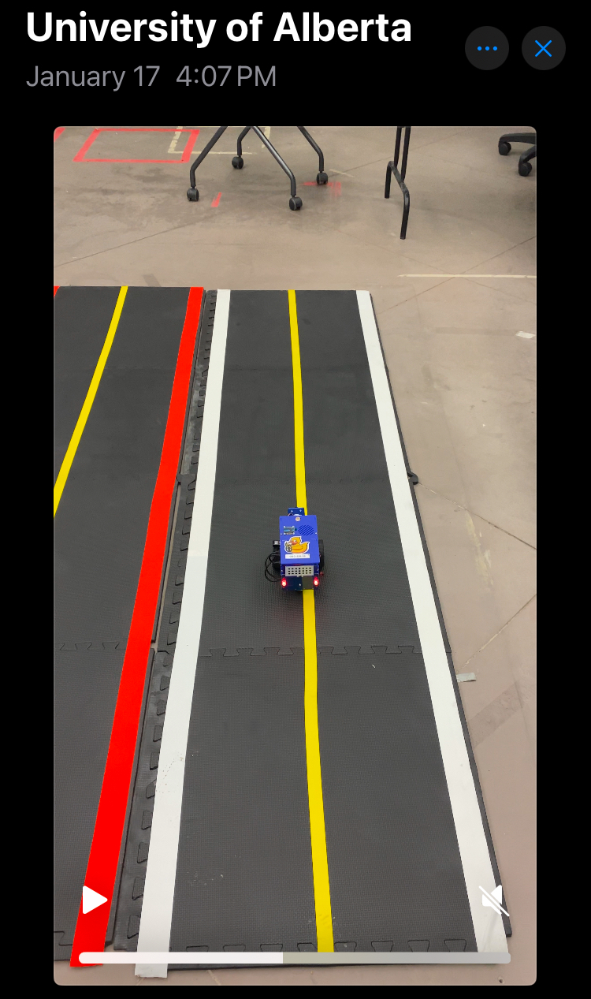
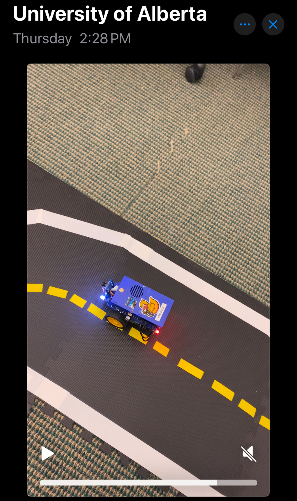
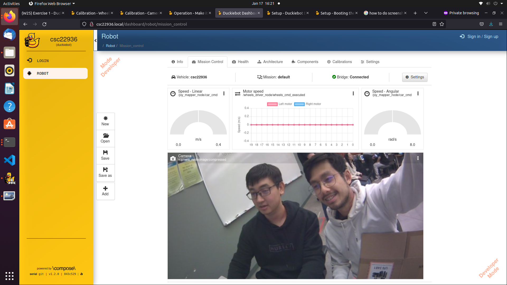
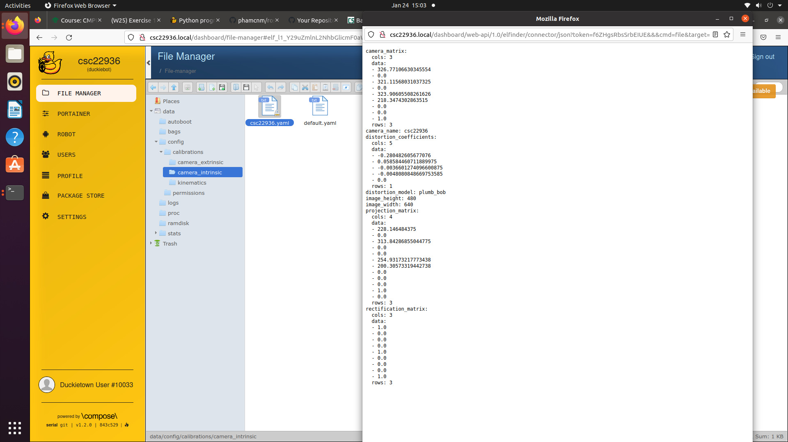
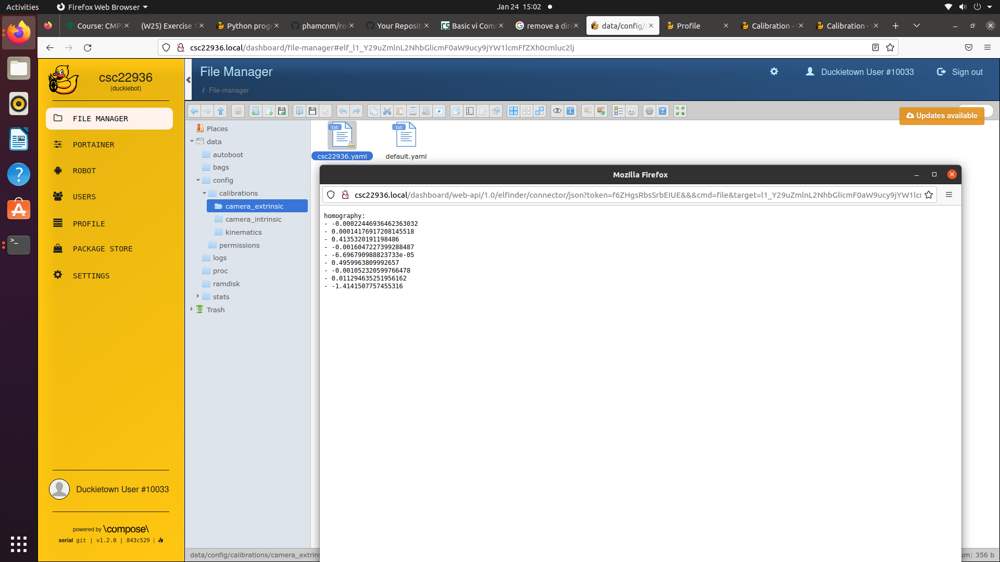

# Lab Exercise 1 Write-up

### Video of Duckiebot driving in a straight line for a distance of 2 meters
  
The video can be found <a href="https://youtube.com/shorts/QZmE8DIUSQY" target="_blank">here</a>.  
The goal is to calibrate the wheel so that the Duckiebot follows the straight yellow line for 2 meters. Our Duckiebot performed well but was veering slightly left towards the end. This phenomenon could be attributed to the uneven flooring, because we experienced the Duckiebot veering inconsistently on this floor area.

### Video of Duckiebot running the lane following demo
  
The video can be found <a href="https://youtube.com/shorts/Wg8ehwbwQ90" target="_blank">here</a>.  
The goal is to calibrate the camera (along side the already calibrated wheels) so that the Duckiebot can detect the lanes and autonomously run a lap while staying on its lane. A pre-built application was used. We speculate that in this application, our Duckiebot detects the white and yellow lines that are the boundaries of the lane, and infer its position in the lane using this vision program and the camera. Our Duckiebot performed well, steadily following its lane without neither drifting in nor out, but had a tendency to step on the lane boundary. This stepping phenomenon could be attributed to the zoom in/out set up of the camera, not to any inability to detect the lane, because the Duckiebot could consistently keep such a distance to this boundary.

### A screen capture of the calibrated kinematics
  
This is the wheel calibration setting of our Duckiebot. Our Duckiebot was veering right at the default setting of 0.0 trim, which meant the left wheel was rotating faster. We incrementally tested higher trim values and settled at 0.075, at which point our Duckiebot could go straight as shown above. The gain parameter was untouched. The result of the first experiment showed that the Duckiebot doesn't veer much anymore, so we stored that calibration setting in kinematics.yaml shown above.

### A screen capture of the camera output and motor signals as seen from the Dashboard
  
This image is the screen capture of the Duckiebot's camera's live image stream that was shown on the Dashboard. The motor signals and speedometer on top show the live angular and lateral speed of the Duckiebot as well as the more granular information about its left and right motor. It was current held in place, hence the values of 0.

### Image calibration
Image calibration is necessary because we have to tune the parameters of the camera (which are not necessarily accurate straight out of factory).

### A screen capture of your intrinsics calibration.yaml file
  
The intrinsic calibration process allows the system to solve for the camera's intrinsic coordinates parameters--focal points, pixel scalings, etc.. A checkers board is tailor-made for this purpose. We needed to shift/move/rotate this board near to far and left to right to aid this automated process of tuning parameters.

### A screen capture of your extrinsics calibration.yaml file
  
The extrinsic Calibration process allows the system to solve for the camera's extrinsic coordinates parameters--rotation and translation relative to the world. We needed to align the position of the Duckiebot to the provided checkers board.

### Docker
Docker is a containerization tool for a software--It makes a software application portable. This allows for an isolated and standardized environment for the robot to run irrespetive of the operating systems, which simplifies the process of deploying applications onto the Duckiebot.

### A screen capture of your Duckiebot saying “Hello from MY_ROBOT”
  
To achieve this functionality, we needed to deploy this software onto the Duckiebot. This requires us to package the Python script into a Docker image. We had the Duckiebot running, then built the image directly on the robot (instead of the desktop), and then issued a command to run it. Details are <a href="https://github.com/acl-24/experimental-mobile-robotics/tree/main/exercise_1" target="_blank">here</a>.

### Write up
In this exercise, we set up the Duckiebot hardware, calibrated its wheels and camera, set up a Duckie dashboard profile and performed hands-on experiments in straight driving and lane following. This exercise built our foundational understanding of how a robot works, covering topics in the engine, the inputs/outputs, the parameter tuning, the networking capacity, and the ability to run a containerized application of the robot.  
We learned the commands to run softwares on the Duckiebot, as well as had first-hand experience of a grand challenge in robotics: how to make the robot performs a desired functionality in the real world--our Duckiebot doesn't consistently move straight on the uneven flooring. We overcame the challenge through not just theoretical understanding but also understanding which properties of the environment that are suitable with is the Duckiebot's desired functionality (such as providing proper lighting or avoiding bumpy flooring areas)

### Reflections, thoughts, comments
This lab took us roughly 5 hours, which is reasonable. Was not challenging--was fun, and helpful.

### Acknowledgements
The exercise was done in collaboration with Alex Liu, with addtional discussions were held with the instructor and TAs.